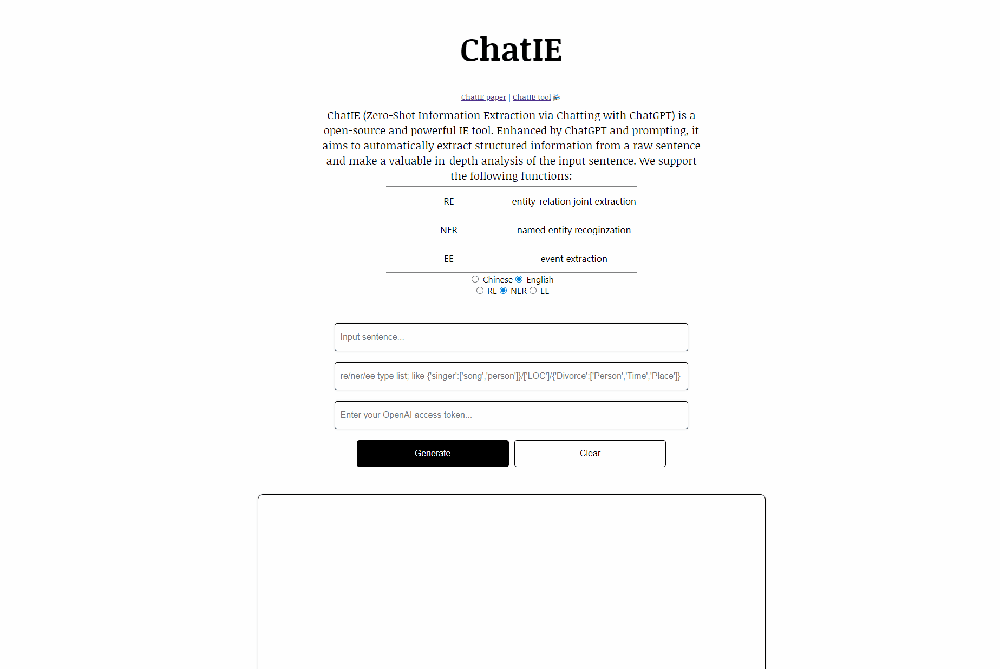
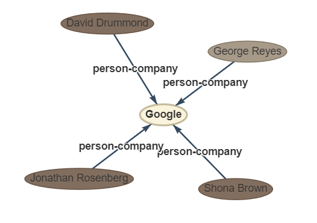
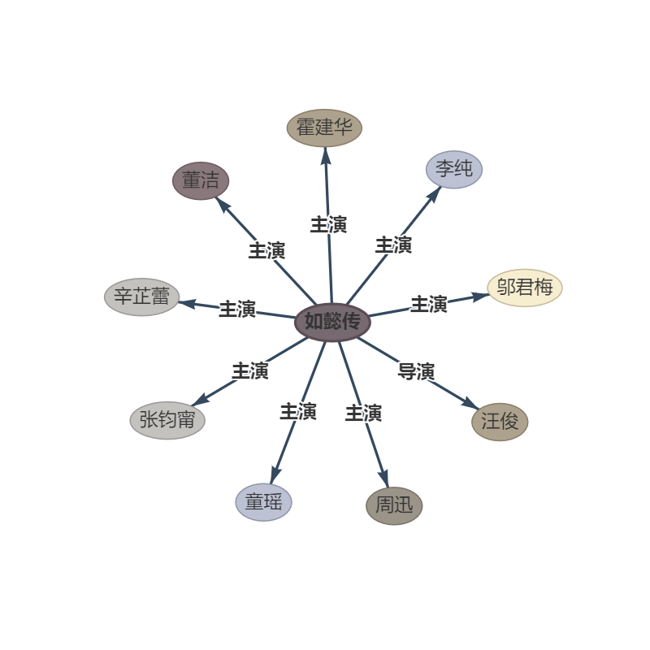
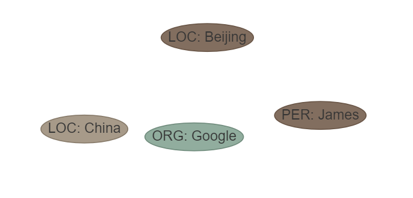
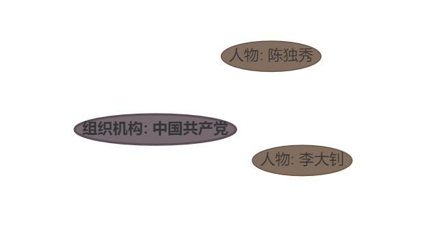
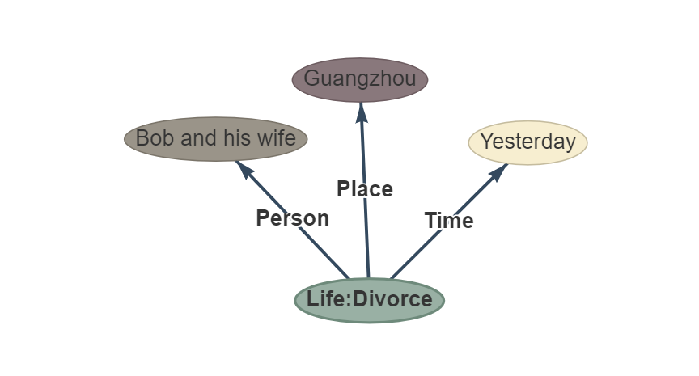
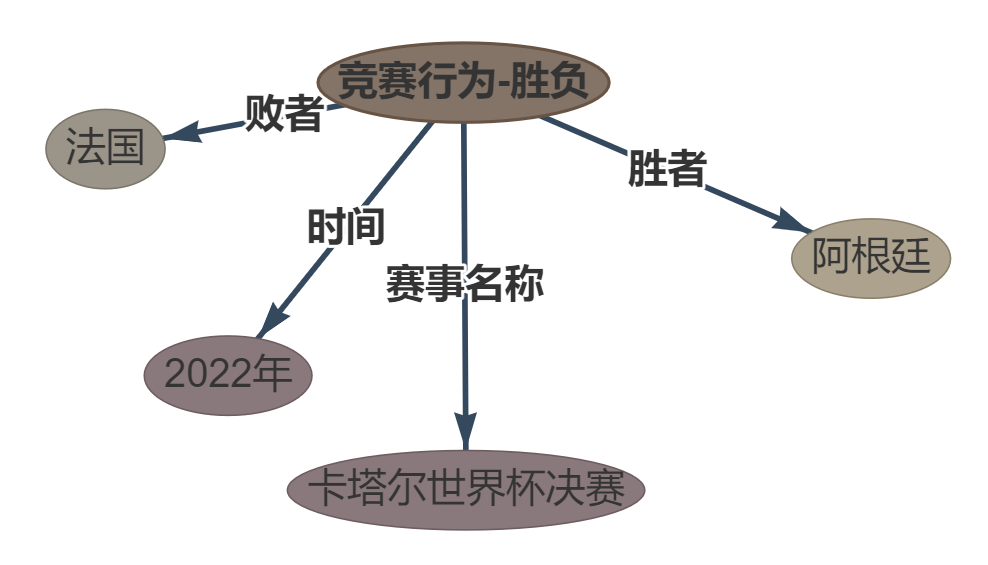
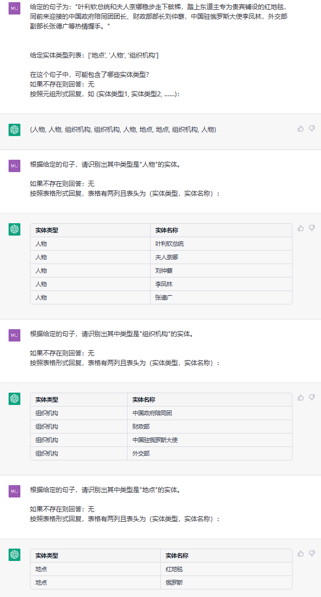

# ChatIE🐬

 


Official repository of paper ["Zero-Shot Information Extraction via Chatting with ChatGPT"](https://arxiv.org/abs/2302.10205). Please star, watch, and fork our repo for the active updates!  

## Abstract
Zero-shot information extraction (IE) aims to
build IE systems from the unannotated text.
It is challenging due to involving little human intervention. Challenging but worthwhile, zero-shot IE reduces the time and effort that data labeling takes. Recent efforts
on large language models (LLMs, e.g., GPT3, ChatGPT) show promising performance on
zero-shot settings, thus inspiring us to explore prompt-based methods. In this work,
we ask whether strong IE models can be constructed by directly prompting LLMs. Specifically, we transform the zero-shot IE task
into a multi-turn question-answering problem
with a two-stage framework (ChatIE). With
the power of ChatGPT, we extensively evaluate our framework on three IE tasks: entityrelation triple extract, named entity recognition, and event extraction. Empirical results
on six datasets across two languages show that
ChatIE achieves impressive performance and
even surpasses some full-shot models on several datasets (e.g., NYT11-HRL). We believe
that our work could shed light on building IE
models with limited resources.

零样本信息抽取（Information Extraction，IE）旨在从无标注文本中建立IE系统，因为很少涉及人为干预，该问题非常具有挑战性。但零样本IE不再需要标注数据时耗费的时间和人力，因此十分重要。近来的大规模语言模型（例如GPT-3，Chat GPT）在零样本设置下取得了很好的表现，这启发我们探索基于提示的方法来解决零样本IE任务。我们提出一个问题：不经过训练来实现零样本信息抽取是否可行？我们将零样本IE任务转变为一个两阶段框架的多轮问答问题（Chat IE）,并在三个IE任务中广泛评估了该框架：实体关系三元组抽取、命名实体识别和事件抽取。在两个语言的6个数据集上的实验结果表明，Chat IE取得了非常好的效果，甚至在几个数据集上（例如NYT11-HRL）上超过了全监督模型的表现。我们的工作能够为有限资源下IE系统的建立奠定基础。

## Methods


## Results


## Tools🧰 
**UPDATE：** **we use the official api, the tool becomes more faster!!! if the key exceed limits please tell us.**  

**NOTICE：** **The response speed depends on the official openai chatgpt api. (sometimes, the official is too crowded and the speed will be slow or the chatgpt will be overloaded.)** Moreover, you better use your own openai key because if our default account is used by multiple people at the same time, the account may be overloaded.  

~~**NOTICE:** because official api is not available in domestic, so we use api from [revChatGPT](https://github.com/acheong08/ChatGPT) and v1 version. But it's **too slow**, so we advise you use the tool offline for study. We will update the api further in the future (**TODO**).~~   

we also provide a IE tool based on GPT3.5, you can see in [GPT4IE](https://github.com/cocacola-lab/GPT4IE)
### Description
ChatIE (Zero-Shot Information Extraction via Chatting with ChatGPT) is a open-source and powerful IE tool [demo](http://124.221.16.143:5000/). Enhanced by ChatGPT and prompting, it aims to automatically extract **structured information** from a **raw sentence** and make a valuable in-depth analysis of the input sentence. Harnessing valuable structured information helps corporations make incisive and business–improving decisions.  


We support the following functions:
| Task | Name| Lauguages |
|---| ---| --- |
| RE | entity-relation joint extraction | Chinese, English|
|NER |named entity recoginzation | Chinese, English|
|EE| event extraction | Chinese, English|

#### RE
This task aims to extract triples from plain texts, such as **(China, capital, Beijing)** , **(《如懿传》, 主演, 周迅)**.
##### Input
- sentence: a plain text.
- relation type list (rtl)* : {'relation type 1': ['subject1', 'object1'], 'relation type 2': ['subject2', 'object2'], ...}

PS: * denote optional, we set default value for them. But for better extraction, you should specify the three list according to application scenarios.
##### Examples
**sentence:** Four other Google executives the chief financial officer , George Reyes ; the senior vice president for business operations , Shona Brown ; the chief legal officer , David Drummond ; and the senior vice president for product management , Jonathan Rosenberg earned salaries of $ 250,000 each .  
**rtl:** default, see file "default-types"  
**ouptut:**  
  

**sentence:** 第五部：《如懿传》《如懿传》是一部古装宫廷情感电视剧，由汪俊执导，周迅、霍建华、张钧甯、董洁、辛芷蕾、童瑶、李纯、邬君梅等主演。  
**rtl:** default, see file "default-types"  
**ouptut:**  
 

---
#### NER
This task aims to extract entities from plain texts, such as **(LOC, Beijing)** , **(人物, 周恩来)**.
##### Input
- sentence: a plain text.
- entity type list (etl)* : ['entity type 1', 'entity type 2', ...]  

##### Examples
**sentence:** James worked for Google in Beijing, the capital of China. 
**etl:**  ['LOC', 'MISC', 'ORG', 'PER']  
**ouptut:**  
  

**sentence:** 中国共产党创立于中华民国大陆时期，由陈独秀和李大钊领导组织。   
**etl:** ['组织机构', '地点', '人物']  
**ouptut:**  
 

---
#### EE
This task aims to extract event from plain texts, such as **{Life-Divorce: {Person: Bob, Time: today, Place: America}}** , **{竞赛行为-晋级: {时间: 无, 晋级方: 西北狼, 晋级赛事: 中甲榜首之争}}**.
##### Input
- sentence: a plain text.
- event type list (etl)* : {'event type 1': ['argument role 1', 'argument role 2', ...], ...}  

**sentence:** Yesterday Bob and his wife got divorced in Guangzhou.  
**etl:**  default, see file "default-types"     
**ouptut:**  
  

**sentence:** 在2022年卡塔尔世界杯决赛中，阿根廷以点球大战险胜法国。  
**etl:** default, see file "default-types"  
**ouptut:**  
 

---

### Setup
react+flask  
1. cd `front-end` and Run `npm install` to download required dependencies.  
2. Run `npm run start`. ChatIE should open up in a new browser tab.  
3. cd `back-end` and Run `python run.py`.  
4. note: node-version v14.17.4  npm-version 9.6.0  
5. you may need to configure **proxy** on your machine.  


## Examples
### RE


### NER


### EE


---
## Data usage policy
We are committed to improving our project and providing you with the best possible experience. To achieve this, we will collect your data to help us understand how you interact with our project and identify areas for improvement. We value the privacy and security of your data and ensure the data only for the purposes of improving our project.

## Citation

Checkout this paper [arxiv: 2302.10205](https://arxiv.org/pdf/2302.10205.pdf)

```
@article{wei2023zero,
  title={Zero-Shot Information Extraction via Chatting with ChatGPT},
  author={Wei, Xiang and Cui, Xingyu and Cheng, Ning and Wang, Xiaobin and Zhang, Xin and Huang, Shen and Xie, Pengjun and Xu, Jinan and Chen, Yufeng and Zhang, Meishan and others},
  journal={arXiv preprint arXiv:2302.10205},
  year={2023}
}
```
