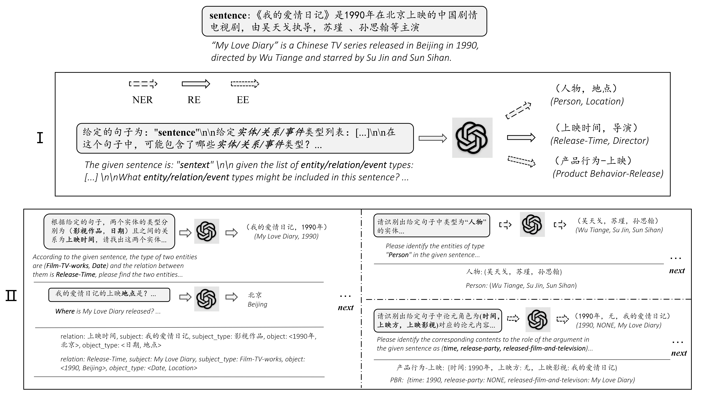
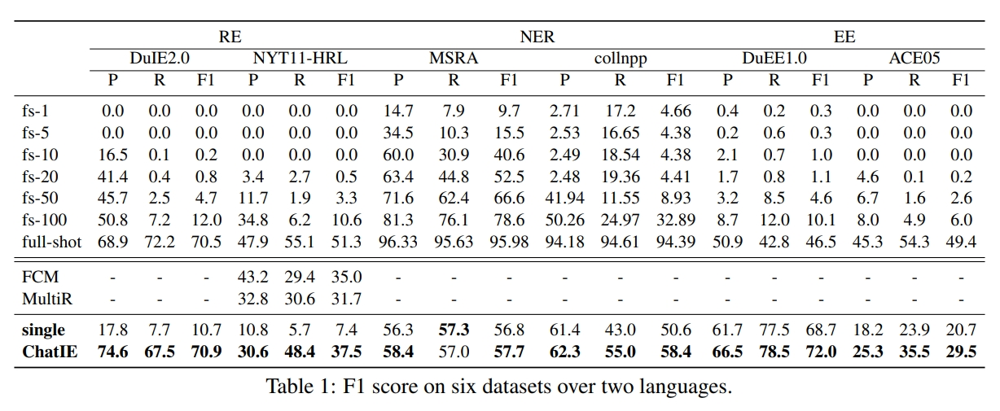
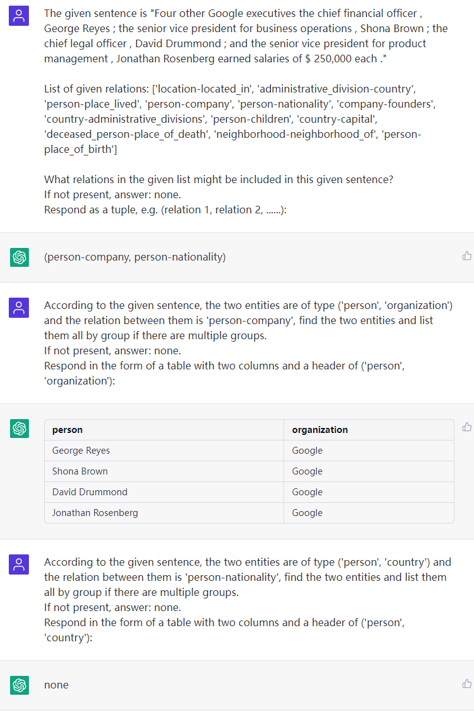
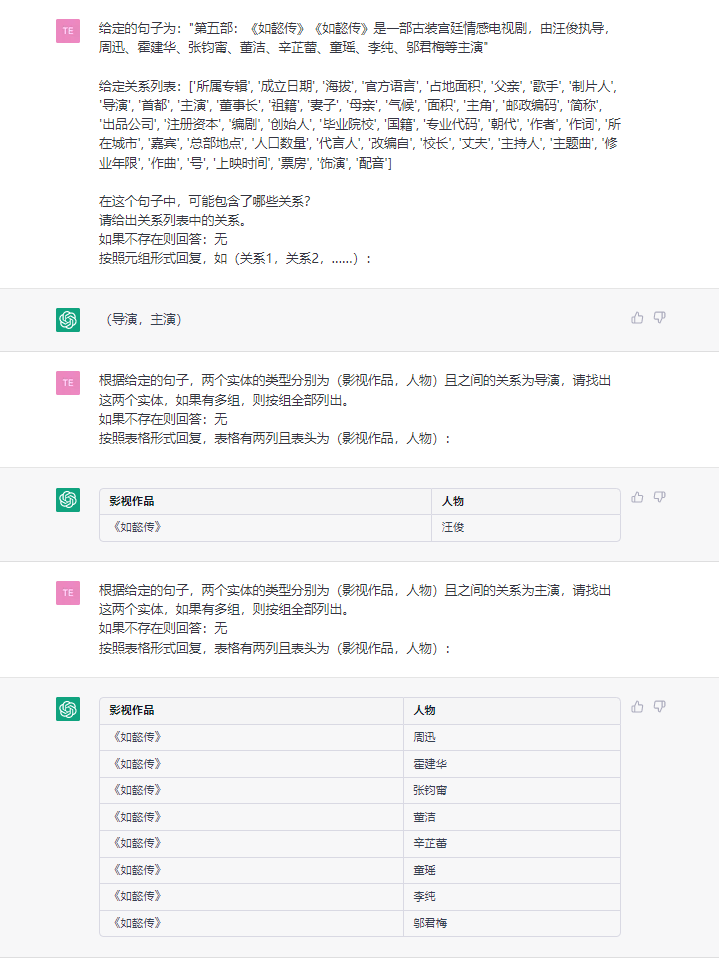
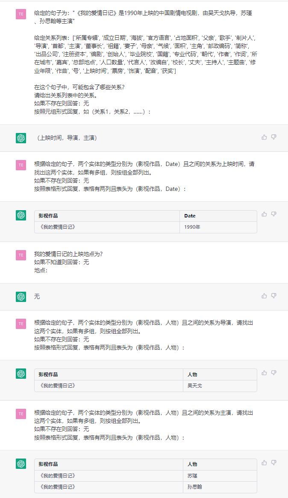
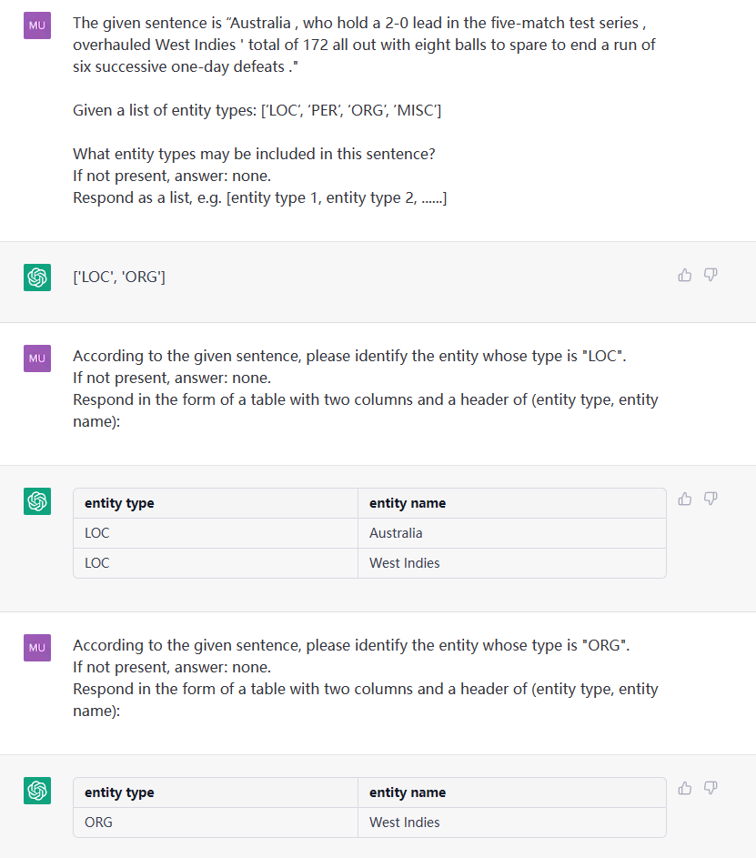
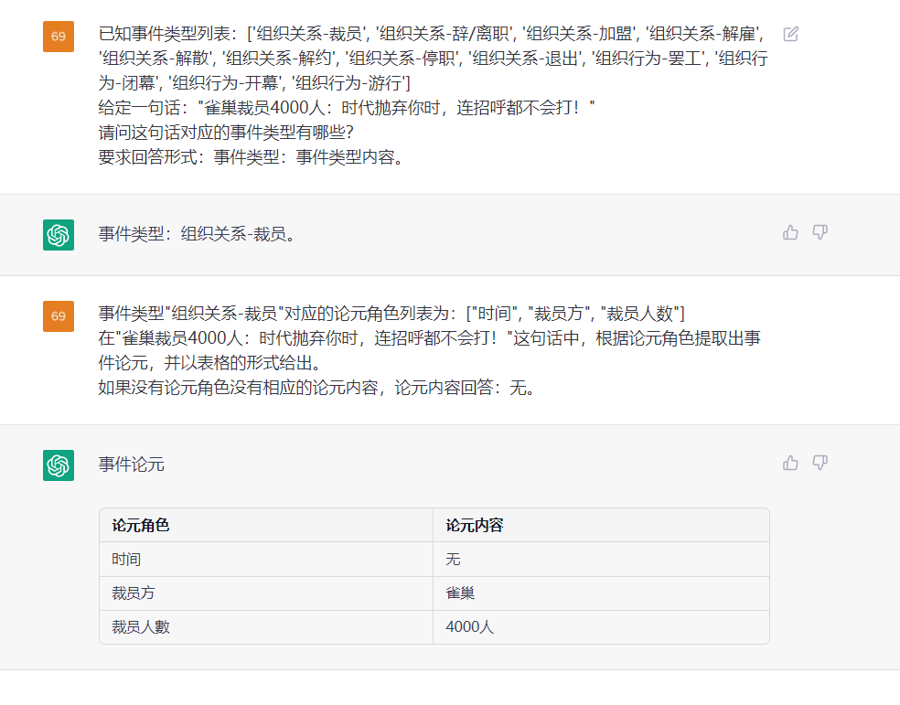
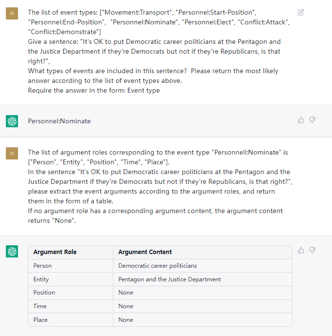

# ChatIE (Zero-Shot Information Extraction via Chatting with ChatGPT)

 

Official repository of paper ["Zero-Shot Information Extraction via Chatting with ChatGPT"](https://arxiv.org/pdf/2302.10205.pdf). Please star, watch, and fork our repo for the active updates!

## Abstract/摘要
Zero-shot information extraction (IE) aims to
build IE systems from the unannotated text.
It is challenging due to involving little human intervention. Challenging but worthwhile, zero-shot IE reduces the time and effort that data labeling takes. Recent efforts
on large language models (LLMs, e.g., GPT3, ChatGPT) show promising performance on
zero-shot settings, thus inspiring us to explore prompt-based methods. In this work,
we ask whether strong IE models can be constructed by directly prompting LLMs. Specifically, we transform the zero-shot IE task
into a multi-turn question-answering problem
with a two-stage framework (ChatIE). With
the power of ChatGPT, we extensively evaluate our framework on three IE tasks: entityrelation triple extract, named entity recognition, and event extraction. Empirical results
on six datasets across two languages show that
ChatIE achieves impressive performance and
even surpasses some full-shot models on several datasets (e.g., NYT11-HRL). We believe
that our work could shed light on building IE
models with limited resources.

零样本信息抽取（Information Extraction，IE）旨在从无标注文本中建立IE系统，因为很少涉及人为干预，该问题非常具有挑战性。但零样本IE不再需要标注数据时耗费的时间和人力，因此十分重要。近来的大规模语言模型（例如GPT-3，Chat GPT）在零样本情况下取得了很好的表现，这启发我们探索基于提示的方法来解决零样本IE任务。我们提出一个问题：不经过训练来实现零样本信息抽取是否可行？我们将零样本IE任务转变为一个两阶段框架的多轮问答问题（Chat IE）,并在三个IE任务中广泛评估了该框架：实体关系三元组抽取、命名实体识别和事件抽取。在两个语言的6个数据集上的实验结果表明，Chat IE取得了非常好的效果，甚至在几个数据集上（例如NYT11-HRL）上超过了全监督模型的表现。我们的工作能够为有限资源下IE系统的建立奠定基础。

## Methods

## Results

## Tools 
We provide two IE tools based on ChatIE and GPT-3.5.   
You can see in:  
- [ChatIETool](https://github.com/cocacola-lab/ChatIETool)
- [GPT4IE](https://github.com/cocacola-lab/GPT4IE)

## Examples
### RE

### NER

### EE

